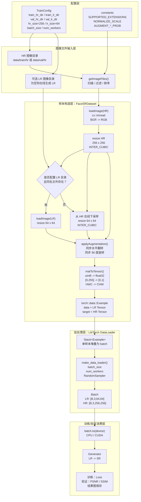
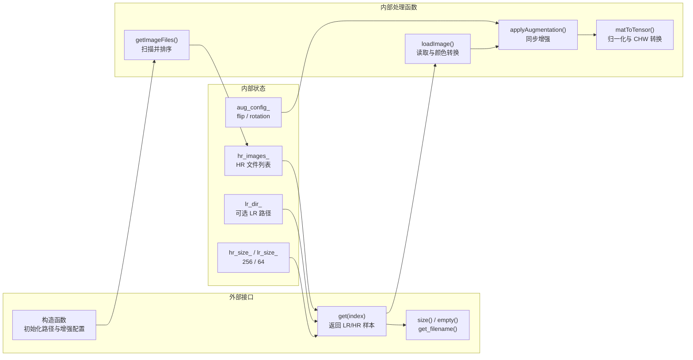
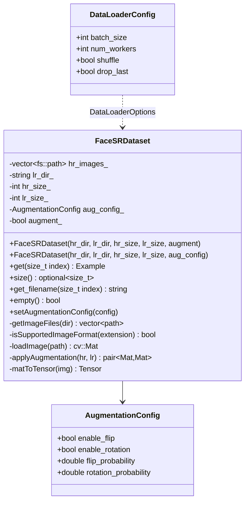
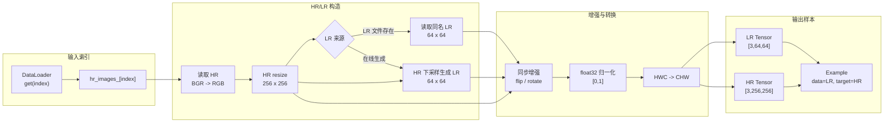
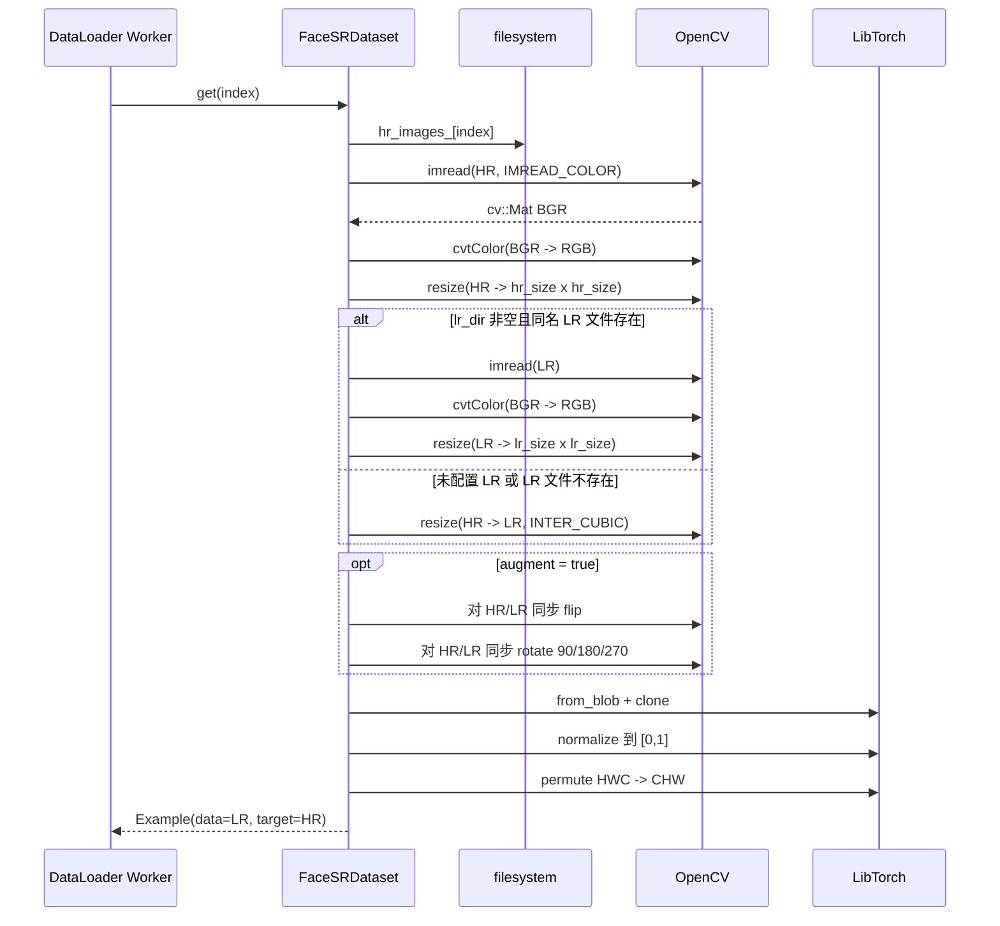
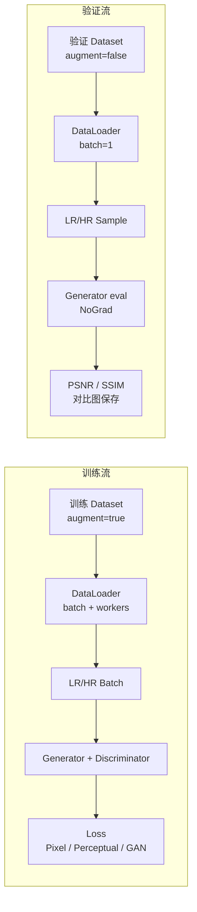
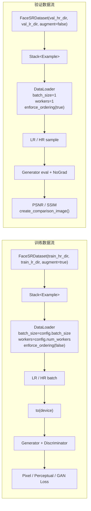
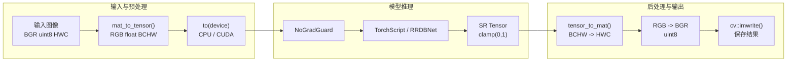
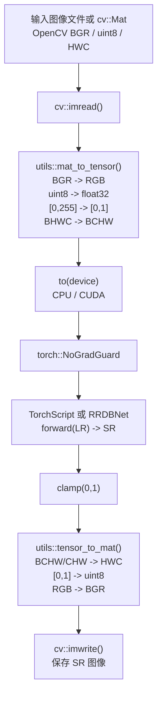

# FaceSR_CPP 数据处理模块结构与架构

本文档依据当前项目源码整理，重点对应：

- `include/utils/dataset.h`
- `src/utils/dataset.cpp`
- `include/utils/image_utils.h`
- `src/utils/image_utils.cpp`
- `src/trainer.cpp`
- `src/inference.cpp`

如果要插入 Word/论文正文，优先使用 `docs/DATA_PROCESSING_FIGURES_WORD.md` 中的“论文插图版”。该版本字号更大、比例更接近正方形，导出为 SVG 后插入 Word 不易模糊。

## 1. 数据处理模块总体架构

### 1.1 论文紧凑版

该版本压缩了节点文字，并采用多列分层布局，导出图片后更接近正方形，适合放入论文正文。

```mermaid
flowchart LR
    subgraph A["配置与输入"]
        direction TB
        Cfg["TrainConfig<br/>路径 / 尺寸 / batch / workers"]
        Const["constants<br/>格式 / 归一化 / 增强概率"]
        HR["HR 目录<br/>train / val"]
        LR["可选 LR 目录<br/>为空则在线生成"]
    end

    subgraph B["文件发现"]
        direction TB
        Scan["getImageFiles()<br/>扫描"]
        Filter["格式过滤<br/>jpg / png / bmp / tiff"]
        Sort["排序<br/>保证顺序稳定"]
    end

    subgraph C["样本构造"]
        direction TB
        LoadHR["读取 HR<br/>BGR -> RGB"]
        ResizeHR["HR resize<br/>256 x 256"]
        MakeLR{"LR 来源"}
        LoadLR["读取 LR<br/>64 x 64"]
        Down["HR 下采样<br/>Bicubic 64 x 64"]
    end

    subgraph D["增强与张量化"]
        direction TB
        Aug["同步增强<br/>翻转 / 旋转"]
        Norm["归一化<br/>uint8 -> float32<br/>[0,1]"]
        CHW["维度转换<br/>HWC -> CHW"]
        Ex["Example<br/>data=LR<br/>target=HR"]
    end

    subgraph E["批处理与训练"]
        direction TB
        Stack["Stack<br/>样本 -> batch"]
        Loader["DataLoader<br/>多线程 / 随机采样"]
        Batch["Batch<br/>LR [B,3,64,64]<br/>HR [B,3,256,256]"]
        Train["Generator / Loss<br/>验证 PSNR / SSIM"]
    end

    Cfg --> HR
    Cfg --> LR
    Const --> Filter
    HR --> Scan --> Filter --> Sort --> LoadHR --> ResizeHR --> MakeLR
    LR --> MakeLR
    MakeLR -- 存在 LR --> LoadLR
    MakeLR -- 在线生成 --> Down
    ResizeHR --> Down
    LoadLR --> Aug
    Down --> Aug
    ResizeHR --> Aug
    Aug --> Norm --> CHW --> Ex --> Stack --> Loader --> Batch --> Train
```

### 1.2 完整说明版

## 2. FaceSRDataset 内部结构

### 2.1 论文紧凑版

### 2.2 完整说明版

## 3. 单样本处理流程

### 3.1 论文紧凑版

### 3.2 完整说明版

## 4. 训练与验证数据流

### 4.1 论文紧凑版

### 4.2 完整说明版

## 5. 推理阶段图像处理流程

训练/验证使用 `FaceSRDataset`，推理阶段不使用该数据集类，而是直接通过 `image_utils` 完成格式转换。

### 5.1 论文紧凑版

### 5.2 完整说明版

## 6. 模块职责划分

| 模块 | 文件 | 主要职责 |
| --- | --- | --- |
| 数据集封装 | `include/utils/dataset.h`, `src/utils/dataset.cpp` | 扫描 HR 文件、读取图像、生成或读取 LR、同步增强、转换为训练 Tensor |
| 图像格式转换 | `include/utils/image_utils.h`, `src/utils/image_utils.cpp` | OpenCV `cv::Mat` 与 LibTorch `Tensor` 互转，保存 Tensor 图像，生成对比图 |
| 训练数据入口 | `src/trainer.cpp` | 构造训练 DataLoader，得到 `[B,3,64,64]` LR 与 `[B,3,256,256]` HR |
| 验证数据入口 | `src/trainer.cpp` | 构造无增强验证 DataLoader，计算 PSNR/SSIM 并保存可视化结果 |
| 推理数据入口 | `src/inference.cpp` | 直接读取输入图像，预处理为 Tensor，模型前向后转换回 BGR 图像 |

## 7. 关键数据格式

| 阶段 | 数据结构 | 通道顺序 | 维度 | 数值范围 |
| --- | --- | --- | --- | --- |
| OpenCV 读入 | `cv::Mat` | BGR | HWC | `uint8 [0,255]` |
| Dataset 内部处理 | `cv::Mat` | RGB | HWC | `uint8 [0,255]` |
| Dataset 输出单样本 | `torch::Tensor` | RGB | CHW | `float32 [0,1]` |
| DataLoader 输出 batch | `torch::Tensor` | RGB | BCHW | `float32 [0,1]` |
| 推理输出保存前 | `cv::Mat` | BGR | HWC | `uint8 [0,255]` |

## 8. 当前实现特点

- 支持图像格式：`.jpg`、`.jpeg`、`.png`、`.bmp`、`.tiff`。
- HR 默认尺寸为 `256 x 256`，LR 默认尺寸为 `64 x 64`，对应 4 倍超分辨率。
- 当 `train_lr_dir` 或 `val_lr_dir` 为空时，LR 由 HR 通过 `cv::INTER_CUBIC` 在线下采样得到。
- 数据增强只在训练集启用，验证集关闭增强。
- 数据增强会对 HR 和 LR 同步执行，避免输入与标签空间错位。
- OpenCV 与 LibTorch 的边界转换集中在 `matToTensor()` 和 `image_utils` 中，核心转换是颜色空间、数值范围和维度顺序。
