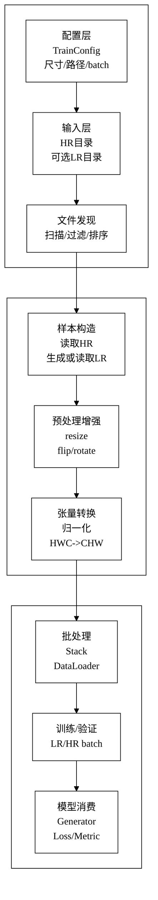
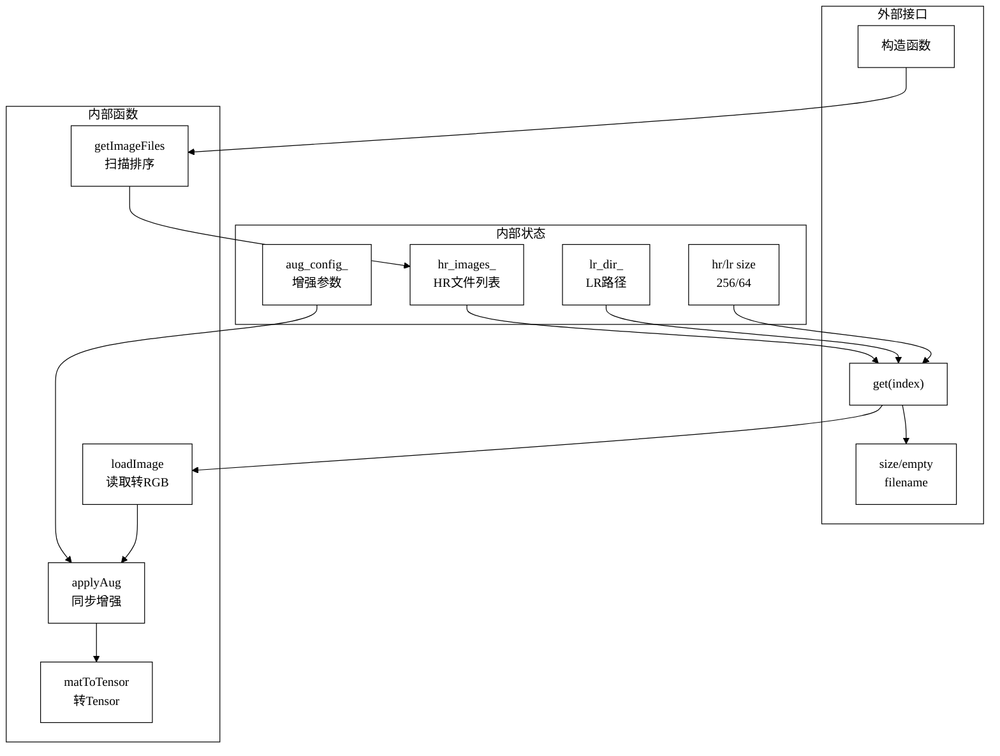
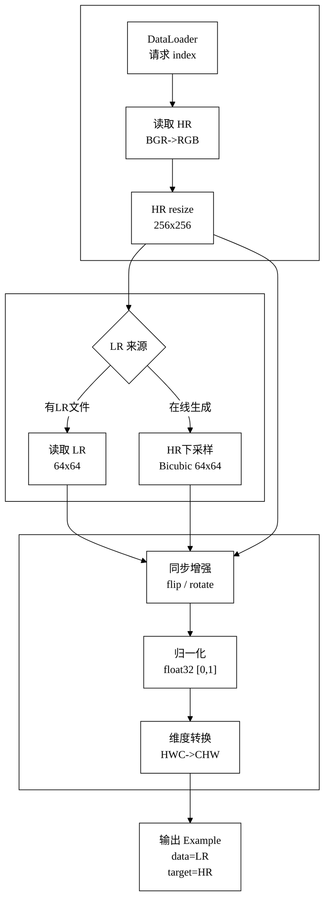
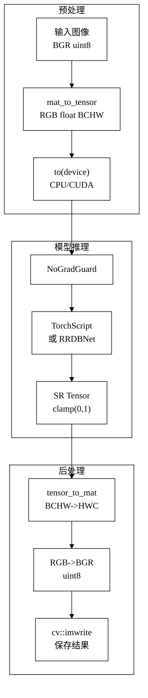

# 数据处理模块论文插图版

本文件只放适合 Word/论文正文使用的 Mermaid 图。图片参数已按《西安石油大学本科毕业设计（论文）模板（2024版）》中的图格式要求调整：节点文字短、图形接近 `4:3`、适合导出后按 `9.00 cm x 6.75 cm` 插入正文。

导出建议：在 Mermaid Live 中使用 `Actions -> Download SVG`，再插入 Word。SVG 放大不模糊。

Word 中设置建议：

- 图片版式：`嵌入型` 或 `上下型`，不要使用 `浮于文字上方`。
- 图片位置：居中。
- 图片尺寸：常规使用 `宽 9.00 cm，高 6.75 cm`；内容较多时可用 `宽 13.50 cm，高 9.00 cm`。
- 图题位置：图片正下方。
- 图题格式：宋体，五号，加粗，居中；图号按章编号，例如 `图5.1  数据处理模块总体架构`。
- 图与上文留一行空格，图题与下文留一行空格。
- 同类图片尺寸尽量统一。

尺寸建议：

| 图号 | 建议尺寸 | 说明 |
| --- | --- | --- |
| 图5.1 | `13.50 cm x 9.00 cm` | 总体架构内容较多，建议用模板允许的较大尺寸 |
| 图5.2 | `9.00 cm x 6.75 cm` | 内部结构图，常规尺寸即可 |
| 图5.3 | `9.00 cm x 6.75 cm` | 单样本流程，已改为三段式 |
| 图5.4 | `9.00 cm x 6.75 cm` | 训练/验证双流程，对称结构 |
| 图5.5 | `9.00 cm x 6.75 cm` | 推理流程，已改为三段式 |

## 图 5.1 数据处理模块总体架构

## 图 5.2 FaceSRDataset 内部结构

## 图 5.3 单样本处理流程

## 图 5.4 训练与验证数据流

```mermaid
%%{init: {"theme": "base", "themeVariables": {"fontSize": "16px", "fontFamily": "SimSun, Microsoft YaHei, Times New Roman", "primaryColor": "#FFFFFF", "primaryTextColor": "#000000", "primaryBorderColor": "#000000", "lineColor": "#000000", "clusterBkg": "#FFFFFF", "clusterBorder": "#000000"}}}%%
flowchart TB
    subgraph Train["训练流"]
        direction LR
        T1["训练Dataset<br/>augment=true"]
        T2["DataLoader<br/>batch/workers"]
        T3["LR/HR Batch"]
        T4["G/D训练"]
        T5["组合损失"]
    end

    subgraph Val["验证流"]
        direction LR
        V1["验证Dataset<br/>augment=false"]
        V2["DataLoader<br/>batch=1"]
        V3["LR/HR Sample"]
        V4["Generator eval"]
        V5["PSNR/SSIM<br/>对比图"]
    end

    T1 --> T2 --> T3 --> T4 --> T5
    V1 --> V2 --> V3 --> V4 --> V5
```

## 图 5.5 推理阶段图像处理流程

